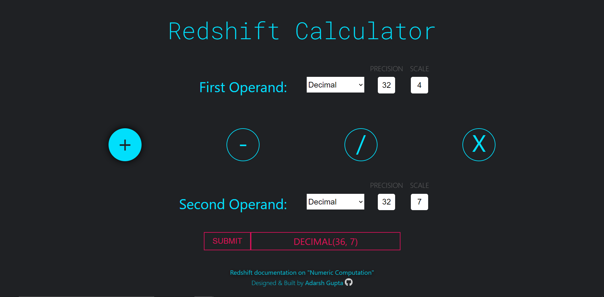

# Redshift Calculator

It's a ReactJS based application to help determine the resultant data type (especially precision and scale for numeric/decimal data types) based on the input data types for Amazon Redshift (cloud data warehouse) database service.

## Problem
It's difficult to predict the resultant precision and scale of a division operation on numeric/decimal datatype columns. 

I have personally found that it is important to know the precision and scale of the result of an operation, since it may lead to data inaccuracies downstream. I have witnessed rounding / calculating variance issues, when using MicroStrategy (a Business Intelligence tool) based on Amazon Redshift as the source.

## Solution

[Amazon Redshift documentation](https://docs.aws.amazon.com/redshift/latest/dg/r_numeric_computations201.html) shares the formulas to calculate the resultant data types of various numeric computations but it's hassle to manually apply those formulas in some cases (like division operation on numeric/decimal data types).

[Redshift Calculator](https://adarshgupta.github.io/Redshift-calc/) should help you get the resultant data types easily when you input the correct data types and order of your operands.

Site [**Current** - Mobile Responsive]: https://adarshgupta.github.io/Redshift-calc/



Old version [**Outdated** - not mobile responsive]: https://redshift-calculator.netlify.app/

# Development Setup

This project was bootstrapped with [Create React App](https://github.com/facebook/create-react-app).

## Initial Setup
1. Clone the repository
```sh
git clone https://github.com/AdarshGupta/Redshift-calc.git
```

2. Change your cmd directory to the cloned project.
```sh
cd Redshift-calc
```

3. Install all the node dependencies of the project using npm
```sh
npm install
```

4. Run the applicatioon in your localhost:3000
```sh
npm run start
```

## Available Scripts

In the project directory, you can run:

### `npm start`

Runs the app in the development mode.<br />
Open [http://localhost:3000](http://localhost:3000) to view it in the browser.

The page will reload if you make edits.<br />
You will also see any lint errors in the console.

### `npm test`

Launches the test runner in the interactive watch mode.<br />
See the section about [running tests](https://facebook.github.io/create-react-app/docs/running-tests) for more information.

### `npm run build`

Builds the app for production to the `build` folder.<br />
It correctly bundles React in production mode and optimizes the build for the best performance.

The build is minified and the filenames include the hashes.<br />
Your app is ready to be deployed!

See the section about [deployment](https://facebook.github.io/create-react-app/docs/deployment) for more information.

### `npm run deploy`

You can run this command from your branch and it'll run the "predeploy" and "deploy" scripts/commands in the `package.json`, to build the application and deploy it to the `gh-pages` branch of my GitHub repository.

## Learn More

You can learn more in the [Create React App documentation](https://facebook.github.io/create-react-app/docs/getting-started).

To learn React, check out the [React documentation](https://reactjs.org/).

Deployment to gh-pages: [Create React App documentation](https://create-react-app.dev/docs/deployment/#github-pages)
